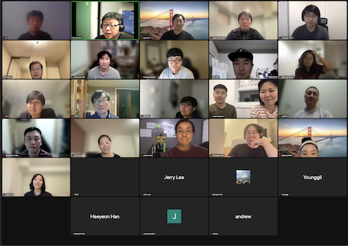
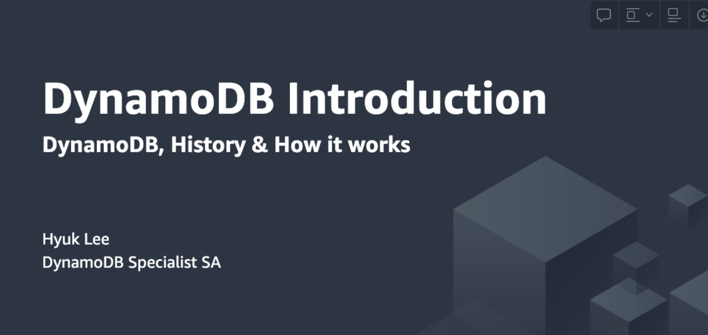
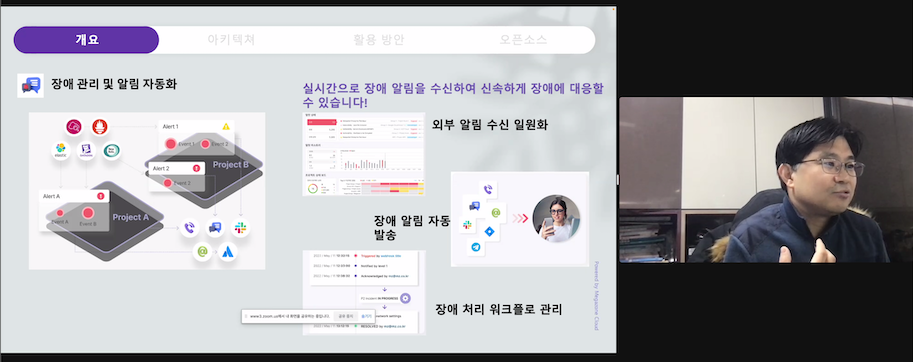
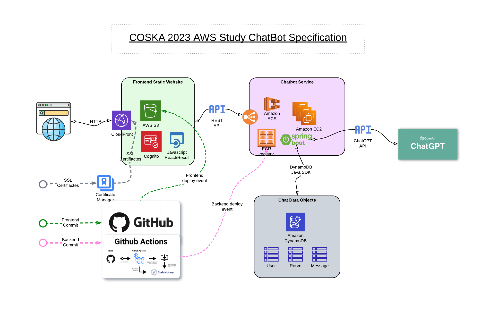
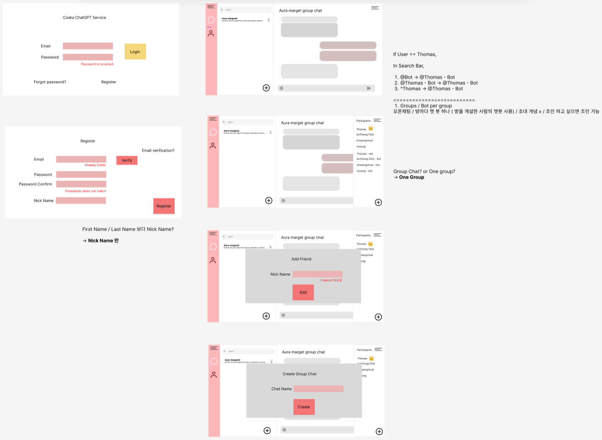

# COSKA 2022 - AWS Seminars : Essentials for DEVs

Timelines and Documents 

> ## Nov. 29th 2022: Kick Off Meeting 

### Kick-off
- 60 applicants / 42 participants in Canada/US/Seoul
- Meetings by Zoom
- Slack channel: coska.slack.com #aws
- Facebook posts ([link](https://www.facebook.com/groups/coska4u/permalink/5229330443780829))

> ## Dec. 06th 2022: Day #1

### AWS Cloud Service Introduction
- AWS Console / AWS CLI
- Regions vs. Availability Zones
- EC2 / S3 / Lambda
- IAM 
- Other interesting services

> ## Dec. 13th 2022: Day #2

### Application Layer Services
- API Gateway / Cloud9 / Amplify / Pinpoint 
- Amazon Connect / Amazon Chime
- CI/CD Pipelines - CodeBuild, CodeDeploy
- Mobile App Test - Device Farm

### AWS Network Layers
- VPC / Subnet / Routing Table, etc.
- Load Balancer (ALB, NLB, GWLB)
- Route 53 (DNS) / Certificate Manager
- CloudFront (CDN)
- Security (WAF, Directory Service, AWS Shield, DDoS remediation)

### Event Monitoring & Analysis
- CloudWatch
- SNS / SQS
- Kinesess, X-Ray, AWS Organization
- Event Bridge
- Athena - Event Query

> ## Dec. 20th 2022: Day #3

### Databases
- RDS (Aurora - MySQL, PostgreSQL, SQL Server, Oracle, MySQL, PostgreSQL, MariaDB)
- No-SQL - DynamoDB (​**link** ​)

### AWS Cloud Certificates

### Megazone Project Reviews
- SpaceONE
- Megazone PoPS

### Discussions on COSKA Open Source Project(s)

-----------

# COSKA 2023 - AWS Open Source Study Project 

# Discussions - Idealization / Decide the ‘one’ to make
> ## Jan. 10th 2023: Sessions #1 
- Gather idea from ALL participants

> ## Jan. 17th 2023: Sessions #2
- Discussions on submitted ideas with tech stacks team want to use (or study)   

> ## Jan. 24th 2023: Sessions #3
- Final decision by vote: 
> “​***Chatbot for community with ChatGPT API integration***​​**”**​

# Design Discussion Sessions 
> ## Jan. 17th 2023: Sessions #1 
- Study - Authentication/Authorization (link : Seminar slide)

> ## Jan. 24th 2023: Sessions #2
- Recoil Seminar (link : Seminar slide)
- Pinpoint for Push Notification

> ## Feb. 7th 2023: Sessions #3
- Open API (Swagger), etc.

> ## Feb. 14th 2023: Sessions #4
- Websocket

> ## Feb. 21st 2023: Sessions #5

# Design Decisions
- **Cognito** (User Management, Authentication)
- **DynamoDB** (Database) 
- **Spring Boot** (API backend)
- **ECR/ECS** for Containerization
- **S3** for static frontend (website) 
- **ALB** (2 subnets, connected with ECS, SSL certificates)
- **Recoil** (frontend Javascript)
- **Websocket** for Chat stream
- **GitHub Actions** for deployment

# References

(link: in Figma [Initial UI specification](https://www.figma.com/file/LxyTTG1CT7iXgAkH5BrubD/Web-UI-ChatGPT?type=design&node-id=0-1))

# DEV Iterations / Implementations 

> Mar. 7th 2023: Implementations #1
> Mar. 14th 2023: Implementations #2
> Mar. 21st 2023: Implementations #3
> Mar. 28th 2023: Implementations #4
> Apr. 18th 2023: Implementations #5
> Apr. 25th 2023: Implementations #6
> May. 9th 2023: Implementations #7
> May. 16th 2023: Implementations #8
> May. 23rd 2023: Implementations #9
> May. 30th 2023: Implementations #10

# Initial Public Release
> ## Jun. 11th 2023:
- Final Code Review before Open to Public
- Update README.md 

> ## Jun. 16th 2023: Participants Gathering, Party) 
- (link : offline gathering :) )

## Swagger UI

http://localhost:8080/swagger-ui/index.html

#### 1. UserController ("/v1/chat/users/")

1.1 GET "/v1/chat/users/{id}" - get a user details

http://localhost:8080/v1/chat/users/user100

1.2 GET "/v1/chat/users" - get list of users

http://localhost:8080/v1/chat/users

1.3 POST "/v1/chat/users" - create user (name, desc)

http://localhost:8080/v1/chat/users

{

    "id": "user100",

    "firstName": "firstName",

    "lastName": "lastName",

    "gptKey": "gptKey",

    "type": "user"

}

1.4 PUT "/v1/chat/users - modify user

http://localhost:8080/v1/chat/users

{

    "id": "user100",

    "firstName": "firstName",

    "lastName": "lastName",

    "gptKey": "gptKey - update",

    "type": "user"

}

1.5 DELETE "/v1/chat/users/{id}" - delete user 

http://localhost:8080/v1/chat/users/user100
